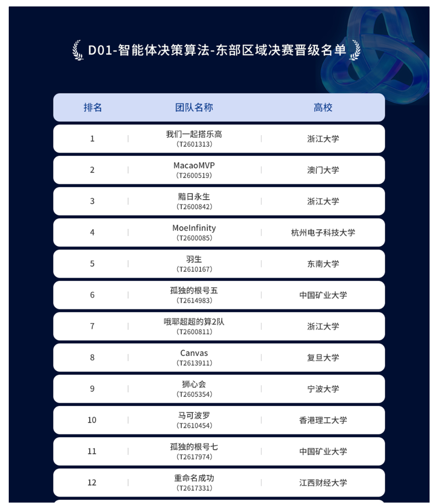

<div align="center">

# 🦁 狮心会 —— 峡谷追猎 PPO 多目标分层决策方案

**Tencent AI Arena · 峡谷追猎赛道**

🏆 **排名：第 9 名 / 152 支参赛队伍**

[](https://www.python.org/)
[](https://pytorch.org/)
[](LICENSE)

</div>

---

## 一、项目概述

本项目是**腾讯 AI Arena — 峡谷追猎赛道**的参赛方案，由 **狮心会** 战队开发，最终取得 **第九名（9/152）** 的成绩。

峡谷追猎是一个典型的**部分可观测马尔可夫决策过程（POMDP）**：英雄在 128×128 的地图上躲避两只怪物的追击，同时收集宝箱与加速 buff，目标是在生存尽可能久的前提下最大化资源收集。环境的核心难点在于：

- **动态威胁**：两只怪物会随时间加速，且追击策略不简单是最近邻，而是带有包围倾向。
- **多目标冲突**："苟活"与"吃宝箱"常常互斥 —— 贪宝箱容易被抓，纯逃跑则资源收益低。
- **高维观测**：地图、怪物位置、资源分布、英雄状态等多源信息需要被有效融合。
- **关键决策**：闪现（Flash）是唯一的位移技能，CD 长达 2000 步，用得好可以穿墙脱险，用不好等于浪费。

面对这些问题，我们设计了一套**多目标分层决策框架**：将任务拆解为"生存"、"收集"、"探索"三条独立目标，各自配备专用 Critic 评估；Actor 则采用三头结构，将动作决策解耦为"是否闪现"、"移动方向"、"闪现方向"三个层次，降低动作空间的耦合度。

> 📌 **方案定位**：本方案不是暴力堆算力的"大模型"路线，而是通过**精细的特征工程**、**合理的网络结构设计**和**多目标解耦的奖励机制**，在资源有限的情况下（单卡 RTX 4090）打出一套可解释、可复现的强基线。

---

## 二、核心设计哲学：为什么这样设计？

### 2.1 多目标解耦（Survive / Collect / Explore）

在峡谷追猎中，"活得久"和"吃得多"是两个本质不同的优化目标，且它们的**最优策略常常冲突**。传统的单头 Critic 只能输出一个标量价值，难以同时兼顾这两个维度。我们用**三头 Critic** 将它们显式分离：

| Critic 头 | 负责评估什么 | 为什么独立？ |
|-----------|-------------|-------------|
| **Survive** | 当前局面的生存价值 | 生存是硬约束，必须独立优化 |
| **Collect** | 收集宝箱/buff 的资源价值 | 与生存常冲突，独立头让模型学会权衡 |
| **Explore** | 地图探索与防绕圈的价值 | 探索是长期收益，单独评估防止短视 |

**为什么不用单头？** 单头 Critic 在训练早期容易被生存信号主导（因为死亡惩罚太大），导致模型完全不敢靠近宝箱，陷入"纯逃跑"的局部最优。三头独立后，Collect 和 Explore 有各自的价值估计和梯度，即使 Survive 头在早期主导，另外两头仍能通过自己的 Advantage 信号推动策略向资源收集方向探索。

### 2.2 动作分层（三头 Actor）

动作空间共 16 维（8 移动方向 + 8 闪现方向）。如果直接用 16 维 softmax 输出，会面临两个问题：

1. **耦合性**：移动和闪现是互斥的（同一时刻只能做一种），但 16 维 softmax 把它们当成平级选项，模型需要额外学习"互斥关系"。
2. **稀疏性**：闪现只有在 CD 转好时才可用，大部分时间只有 8 个移动方向合法，导致 16 维输出中 8 维长期处于"被 mask 掉"的状态，梯度浪费。

我们的解法是**三头分层**：

```
head_flash_gate (2维):  [不闪, 闪]
head_move_dir   (8维):  [右, 右上, 上, 左上, 左, 左下, 下, 右下]
head_flash_dir  (8维):  [右, 右上, 上, 左上, 左, 左下, 下, 右下]
```

推理时，先采样 `gate`：如果不闪，再从 `move_dir` 采样；如果闪，再从 `flash_dir` 采样。这样**联合概率自然分解为 `p(gate) × p(dir|gate)`**，与动作本身的物理结构一致。从信息论角度看，这相当于在策略网络中引入了**先验结构（inductive bias）**，减少了策略搜索空间。

### 2.3 压力动态调制（Pressure-Based Reward Shaping）

这是本方案 reward 设计的核心创新。我们定义了一个**压力分数（pressure）**，实时衡量当前局面的危险程度：

```
pressure = clip(0.4×shrink_rate + 0.3×sandwich + 0.2×danger_level + 0.1×escape_loss, 0, 1)
```

- **shrink_rate**：怪物与英雄距离的收缩速度（距离在快速缩小 → 压力高）
- **sandwich**：两怪是否形成夹击（夹角 > 120° → 压力高）
- **danger_level**：怪物距离归一化后的危险等级
- **escape_loss**：最优逃跑方向与实际移动方向的偏离度

压力分数用于**动态调整三组奖励的权重**：

| 奖励组 | 权重公式 | 含义 |
|--------|----------|------|
| Survive | `1.0 + 1.5 × pressure` | 压力越大，生存奖励越重要（最高 2.5 倍） |
| Collect | `1.0 - 0.7 × pressure` | 压力越大，越不鼓励贪宝箱（最低 0.3 倍） |
| Explore | `1.0 - 0.6 × pressure` | 压力越大，探索奖励也降低（最低 0.4 倍） |

**为什么这样设计？** 这模仿了人类玩家的直觉：怪物贴脸时（高压力），脑子里想的只有"跑"；安全时（低压力），才考虑"吃宝箱"和"逛地图"。如果不做这种动态调制，模型会在高压力时仍然被"吃宝箱"的奖励吸引，导致频繁送人头。压力调制相当于给奖励函数装了一个"情境感知开关"。

---

## 三、特征工程（1899 维输入）

### 3.1 总体布局

特征向量共 **1899 维**，按语义切分为 20 个字段，最终归并为 **8 个 Token** 送入 Transformer。以下是逐段解释：

| 索引范围 | 维度 | 内容 | 对应的决策问题 | 归属 Token |
|----------|------|------|---------------|-----------|
| [0:4] | 4 | 英雄位置(xy) + 闪现 CD + buff 剩余时间 | "我现在是什么状态" | self |
| [4:14] | 10 | 2 只怪物各 5 维（视野/位置/速度/距离） | "危险从哪来" | monster |
| [14:26] | 12 | 最近 3 个宝箱各 4 维（存在/距离/方向） | "哪个资源值得追" | treasure |
| [26:34] | 8 | 最近 2 个 buff 各 4 维（存在/距离/方向） | "加速道具在哪" | buff |
| [34:1798] | 1764 | **4 通道 21×21 多通道地图** | "地形+实体空间关系" | map |
| [1798:1806] | 8 | 8 方向逃跑深度 | "哪个方向有退路" | escape |
| [1806:1814] | 8 | 8 方向怪物感知安全分 | "考虑怪物后哪里最安全" | escape |
| [1814:1817] | 3 | 局部拓扑（开阔率/可走方向数/死角标记） | "这里是不是死角" | escape |
| [1817:1825] | 8 | 怪物短期记忆（2 只 × 4 维） | "怪物消失前在哪" | monster |
| [1825:1833] | 8 | 8 方向闪现穿墙机会评分 | "闪现能不能穿墙" | flash |
| [1833:1843] | 10 | 死胡同分析（BFS 版） | "我是不是在死胡同里" | escape |
| [1843:1859] | 16 | 合法动作掩码 | "哪些动作可用" | self |
| [1859:1862] | 3 | 进度（步数/是否加速/加速倒计时） | "游戏到什么阶段" | self |
| [1862:1874] | 12 | 探索特征（位移+陌生度+资源安全+buff 进度） | "哪里没去过" | explore |
| [1874:1882] | 8 | 闪现落点安全分 | "闪往哪里不会死" | flash |
| [1882:1884] | 2 | 被困状态 + 能否闪现脱险 | "被困了吗" | flash |
| [1884:1892] | 8 | 闪现净距离改善量 | "朝这方向闪值不值" | flash |
| [1892:1894] | 2 | 反绕圈（是否新格/覆盖率） | "在绕圈吗" | explore |
| [1894:1897] | 3 | **压力特征**（shrink/sandwich/loss） | "当前压力多大" | escape |
| [1897:1899] | 2 | **闪现战略特征**（价值/机会成本） | "这闪现在全局值不值" | flash |

### 3.2 关键特征的设计理由

#### 4 通道 21×21 地图（1764 维）

这是特征中维度最大的部分，但它是**空间感知的核心**。

- **Channel 0（通行性）**：1=可走，0=墙。告诉模型哪里是路、哪里是障碍。
- **Channel 1（怪物位置）**：可见怪物的栅格标记为 1。让模型在 CNN 中直接感知威胁的空间分布。
- **Channel 2（宝箱位置）**：可拾取宝箱标记为 1。
- **Channel 3（buff 位置）**：可拾取 buff 标记为 1。

**为什么是 21×21？** 这是环境返回的原生视野尺寸。我们不做裁剪，保持完整视野，因为怪物可能从视野边缘突然出现，裁剪会丢失关键信息。

**为什么用 4 通道而不是 1 通道？** 单通道只能表示"有什么"，无法区分"怪物"和"宝箱"。多通道让 CNN 可以学习"怪物靠近宝箱"这种组合模式。

#### DDA 射线遮挡检测

环境返回的宝箱/buff 列表包含 21×21 视野内的**所有物件**，即使中间有墙挡着也会出现在列表里。如果不处理，模型就会"透视"看到墙后面的宝箱，做出"朝墙后宝箱移动"的愚蠢决策。

我们在预处理中加入了 **DDA（Digital Differential Analysis）射线检测**：从英雄位置到物件位置画一条线，检查中间是否有墙体阻断。如果被挡住，该物件直接从特征中剔除。这相当于给模型装上了"视线判断"，确保输入信息符合物理规律。

#### 怪物短期记忆（8 维）

环境只返回**当前可见**的怪物信息。当怪物被墙体遮挡时，模型会突然"丢失"对怪物的感知，导致决策剧烈抖动（比如从"逃跑"瞬间变为"探索"）。

我们设计了**短期记忆机制**：记录怪物最后出现的位置、方向和有效帧数。即使怪物当前不可见，记忆特征仍然会告诉模型"怪物大概在这个方向，80 步内曾出现过"。这有效缓解了部分可观测性带来的决策抖动。

#### 死胡同分析（BFS 版，10 维）

用 BFS 从英雄位置向外搜索，计算：
- 死胡同得分（当前位置是否是死胡同）
- 8 个方向是否是出口
- 被困度（周围可通行方向的数量）

**为什么重要？** 模型如果不理解"死胡同"这个概念，会频繁走进只有单一出口的狭窄通道，被怪物堵死。BFS 死胡同分析相当于给模型提供了一个**拓扑层面的先验知识**，让它学会"不要走进死路"。

---

## 四、网络架构（8 Token + Transformer + 三头输出）

### 4.1 整体流程

```
obs(1899维) ──切片重组──┬── self(23)     ──→ MLP ──→ 128 ── token0
                       ├── monster(18)  ──→ MLP ──→ 128 ── token1
                       ├── treasure(12) ──→ MLP ──→ 128 ── token2
                       ├── buff(8)      ──→ MLP ──→ 128 ── token3
                       ├── map(1764)    ──→ FPN CNN → 128 ── token4
                       ├── escape(32)   ──→ MLP ──→ 128 ── token5
                       ├── flash(28)    ──→ MLP ──→ 128 ── token6
                       └── explore(14)  ──→ MLP ──→ 128 ── token7
                                                │
                               Transformer × 2 (MHA 8头 + FFN 256)
                                                │
                                   fusion 1024 → 256 → 64
                                                │
                      ┌── 三头 Actor (64→32→N) ────┬──────────────┬──────────────┐
                      │  gate(2)  move_dir(8)  flash_dir(8)
                      │
                      └── 三头 Critic (64→32→1) ───┬──────────────┬──────────────┐
                         survive(bias=+1.0)  collect  explore
```

### 4.2 为什么用 Transformer 做融合？

特征来自 8 个截然不同的语义来源（英雄、怪物、地图、闪现…），它们之间的关系是**动态的、上下文依赖的**：

- 怪物在地图上的位置会影响"逃跑深度"的解读；
- 闪现 CD 状态会影响"怪物记忆"的紧急程度；
- 死胡同拓扑会改变"宝箱吸引力"的权重。

如果用简单的全连接层拼接所有特征，模型只能学到**固定的加权组合**，无法适应这些动态关系。Transformer 的自注意力机制（Self-Attention）让不同 Token 之间可以**动态地、根据当前局面调整彼此的影响力**。例如，`monster` token 可以通过注意力机制告诉 `escape` token："怪物在东边，所以东边的逃跑深度要打折扣"。

**为什么是 2 层而不是更深？** 实验发现 2 层 Transformer 已经足以捕捉 Token 间的二阶交互关系（如"怪物位置 + 地图障碍 = 有效逃跑方向"）。更深的网络（4+ 层）在这个任务上收益递减，但参数量和训练时间显著增加。在资源有限的情况下，2 层是性价比最高的选择。

### 4.3 Token Type Embedding

我们为 8 个 Token 各自分配了一个可学习的类型嵌入（Type Embedding），加到对应 Token 的 128 维特征上。

**为什么需要这个？** 自注意力机制本身是对称的：它不知道"token0 是 self，token1 是 monster"。Type Embedding 相当于给每个 Token 打上一个"身份标签"，让注意力层知道"我正在看的是一个怪物特征，还是一个地图特征"。这类似于 NLP 中的 Position Embedding，但这里是**语义位置**而非空间位置。

### 4.4 地图 FPN（Feature Pyramid Network）

21×21 的 4 通道地图通过 3 层卷积 + 自适应池化提取特征：

```
Conv1: 4 → 32,  保持 21×21
Conv2: 32 → 32, 下采样到 11×11
Conv3: 32 → 32, 下采样到 6×6
→ 每层后接 AdaptiveAvgPool2d(1) → 32 维
→ 拼接 3×32=96 维 → FC → 128 维
```

**为什么用 FPN 而不是单层 CNN？** 不同尺度的信息对决策的重要性不同：
- **大尺度（21×21）**：判断"整体地形是开阔还是狭窄"；
- **中尺度（11×11）**：判断"附近有没有怪物/宝箱"；
- **小尺度（6×6）**：判断"精确的位置关系"。

FPN 同时保留三个尺度的信息，避免了下采样导致的细节丢失。

### 4.5 Critic Survive 的 Bias = +1.0

在 `critic_survive` 的最后一层，我们将 bias 初始化为 **+1.0**。

**为什么？** 这是为了让模型在训练初期就相信"活着是有价值的"。如果 bias 从 0 开始，模型在早期可能会低估生存价值（因为死亡是稀疏事件，大部分步的 survival reward 只有 +0.002），导致策略过于冒险。+1.0 的先天偏置相当于给模型一个"保守先验"，帮助它在训练早期就建立起"先活下来"的基本意识。

---

## 五、奖励函数设计（三组动态调制）

### 5.1 总体结构

奖励被分为 **三组 + 独立项**，每组乘上压力调制权重后，累加成三路 reward 喂给三头 Critic：

```
[survive_reward, collect_reward, explore_reward]
```

### 5.2 Survive 组（生存奖励）

| 奖励项 | 说明 | 系数 | 设计理由 |
|--------|------|------|----------|
| **基础生存** | 每活一步 +0.002 | 0.002 | 保证模型始终收到"活着"的微弱正反馈 |
| **怪物距离 shaping** | 远离怪物=正，靠近=负 | 0.12 | 引导模型保持安全距离 |
| **逃跑深度变化** | 移到可跑更远的位置=正 | 0.15 | 鼓励去开阔区域，不要自断退路 |
| **怪物感知安全分变化** | 移到更安全方向=正 | 0.12 | 综合考虑怪物方向后的安全评估 |
| **死角惩罚** | 站在 ≤1 个出口的位置扣 0.08 | -0.08 | 惩罚走进死角 |
| **危险方向选择** | 怪物近时朝安全方向跑有奖励 | 0.06 | 高压时的方向引导 |
| **开阔度奖励** | 位置越开阔奖励越高 | 0.02 | 鼓励去大空间拉扯 |
| **包夹惩罚** | 两怪夹角 >120° 时惩罚 | -0.06 | 惩罚被包围的局面 |
| **闪现脱险** | 闪现后怪物距离明显拉开 | 0.12 | 奖励"有效闪现" |
| **闪现浪费惩罚** | 闪现后距离没改善 | -0.08 | 惩罚"乱按闪现" |
| **被困闪现脱险** | 被困时用闪现逃出生天 | 独立项 | 强信号，直接累加 |
| **跨怪闪现** | 闪现穿过怪物 | 独立项 | 高风险高回报的操作 |
| **加速前缓冲惩罚** | 怪物即将加速时还贴太近 | 0.04 | 提前拉开距离 |
| **第二怪靠近惩罚** | 第二只怪距离过近 | -0.03 | 防止被第二只怪偷袭 |

### 5.3 Collect 组（收集奖励）

| 奖励项 | 说明 | 系数 | 设计理由 |
|--------|------|------|----------|
| **靠近宝箱** | 朝最近宝箱移动 | 0.16 | 引导模型主动找宝箱 |
| **拾取宝箱** | 实际吃到宝箱（稀疏） | 4.0 | 稀疏大奖，明确信号 |
| **拾取 buff** | 实际吃到加速 buff | 1.0 | 加速是重要战略资源 |
| **靠近 buff** | 朝 buff 移动 | 0.12 | 引导收集 buff |
| **无怪宝箱 boost** | 安全时靠近宝箱倍率 ×2.5 | 2.5 | 安全时鼓励大胆吃 |

**为什么拾取宝箱是 4.0 而不是更大？** 早期尝试过 10.0，但会导致 `collect` Critic 的 value 估计过大，梯度爆炸，进而影响整个训练稳定性。4.0 是一个平衡点：足够让"吃宝箱"成为明确目标，又不至于压垮 Critic。

### 5.4 Explore 组（探索奖励）

| 奖励项 | 说明 | 系数 | 设计理由 |
|--------|------|------|----------|
| **首次到达新格** | 探索新区域 | 0.04 | 好奇心驱动，防止绕圈 |
| **朝宝箱方向探索** | 向资源方向移动 | 0.05 | 把探索和收集结合 |
| **原地不动惩罚** | 站着不动每步扣 0.03 | -0.03 | 逼模型动起来 |
| **撞墙惩罚** | 选了方向但没位移 | -0.04 | 惩罚无效动作 |
| **重复位置惩罚** | 100 步内频繁回同一位置 | -0.06 | 防止绕圈 |
| **后期漂移硬约束** | coverage < 20% 时线性扣分 | -0.40 | 强制走出绕圈窝 |
| **朝边界移动奖励** | _coverage 低时去边界 | 0.10 | 把模型从中心推向边缘 |

**为什么有"后期漂移硬约束"？** 模型在训练中期容易学会"绕小圈"——在一个小区域内来回移动，怪物追不上，但 coverage（探索覆盖率）极低。这种行为在生存指标上表现不错，但收集和探索指标很差。我们在 200 步后加入了 coverage 硬约束：如果 200 步窗口内的唯一格子比例 < 20%，就按缺口线性扣分。这相当于给模型装了一个"防摆烂"机制。

### 5.5 独立项（不受压力调制）

- **被困闪现脱险**：当 `trap_status=1`（被困）且使用闪现成功脱离时，给予固定正奖励。
- **跨怪闪现**：闪现落点穿过怪物当前位置，高风险操作给予额外奖励。

**为什么独立？** 这些是极端场景下的关键操作，信号必须**不受压力调制削弱**。如果它们也被乘上 `w_survive`，在高压力时会被放大，但低压力时也会被缩小，导致模型学不到"被困时必须闪现"这一普适策略。

---

## 六、PPO 算法设计

### 6.1 三路独立 GAE

标准 PPO 只算一组 Advantage。我们对 Survive / Collect / Explore 三路 reward 各自运行 GAE：

```python
# 对每一路独立计算 delta 和 gae
delta = reward + gamma * next_value - value
gae = gae * gamma * lambda + delta
```

**为什么独立？** 三路 reward 的量级和稀疏性完全不同：Survive 是密集信号（每步都有），Collect 是稀疏信号（吃到才有），Explore 是中期信号（几十步才体现）。如果混在一起算 GAE，稀疏信号会被密集信号的噪声淹没。独立 GAE 保证了每一路的 Advantage 都有自己的清晰信噪比。

### 6.2 Advantage 归一化 + 加权合成

三路的 Advantage 在送入 Policy Loss 前，先各自做**独立归一化**（减去均值除以标准差），再按权重合成：

```python
adv = 1.0 * norm(adv_survive) + 1.0 * norm(adv_collect) + 1.0 * norm(adv_explore)
```

**为什么归一化？** Collect 的 Advantage 天然比 Survive 大（因为稀疏奖励的 GAE 波动更剧烈）。如果不归一化，Collect 会"吃掉"Policy Gradient 的主导权，导致策略只关注收集而忽视生存。归一化后，三路 Advantage 在**同一量级**上竞争，模型才能学会真正的权衡。

### 6.3 三头独立 Value Clip

标准 PPO 的 Value Clip 范围通常是 `[-0.2, +0.2]`（与 Policy Ratio 的 clip 参数共用）。我们发现这个范围对三头 Critic 来说**太小了**：Critic 需要快速学习不同局面的价值差异，0.2 的 clip 会把 value 更新卡死。

我们将 Value Clip 单独配置为 **2.0**（是标准值的 10 倍）：

```python
v_clip = old_value + (new_value - old_value).clamp(-2.0, +2.0)
```

**为什么可以这么大？** Value 的学习目标是 TD-Return，它的波动范围天然比 Policy Ratio 大得多。Policy Ratio 接近 1.0，所以 clip 0.2 是合理的；但 Value 可能从 0.5 变到 5.0（比如从早期到加速后期），0.2 的 clip 会让 Critic 学得太慢。独立的 `VALUE_CLIP_RANGE=2.0` 让 Critic 有足够的学习自由度。

### 6.4 联合概率与 Masked Softmax

三头 Actor 的输出通过**概率分解**合成 16 维联合动作概率：

```python
joint_prob[0:8]  = p_gate[0] * p_move      # 不闪，选移动方向
joint_prob[8:16] = p_gate[1] * p_flash_dir # 闪，选闪现方向
```

每一头内部使用 **Masked Softmax**：不合法的动作（如闪现 CD 中时的 8 个闪现方向）被设为极小 logit，softmax 后概率为 0。

**为什么用 Masked Softmax 而不是直接在采样时过滤？** 在训练阶段，我们需要计算 `new_prob / old_prob`（PPO 的 ratio）。如果直接在采样时过滤，不合法动作的概率是不确定的，会导致 ratio 计算错误。Masked Softmax 保证了不合法动作的概率**严格为 0**，且合法动作的概率之和严格为 1，数学上自洽。

### 6.5 Beta 线性衰减

Entropy 系数 Beta 从 0.003 线性衰减到 0.0003，共 30000 步。

**为什么衰减？** 训练早期需要高探索（大 Beta），让模型充分尝试各种动作；训练后期需要低探索（小 Beta），让模型收敛到稳定策略。线性衰减是最简单有效的策略，避免了手动调参。

---

## 七、训练配置与监控

### 7.1 关键超参数

| 参数 | 值 | 说明 |
|------|-----|------|
| Gamma | 0.995 | 高折扣因子，重视长期收益（生存游戏必须看长远） |
| Lambda | 0.95 | GAE 参数，平衡偏差与方差 |
| Learning Rate | 2e-4 | Adam，对 Transformer 来说偏保守，防止震荡 |
| Clip Param | 0.2 | PPO 标准值 |
| Grad Clip | 1.0 | 从 0.5 提到 1.0，避免 Transformer 梯度被卡死 |
| VF Coefficient | 1.0 | Value Loss 权重，与 Policy Loss 同等重要 |
| Batch Size | 64 | 单卡 4090 上的稳定配置 |

### 7.2 监控指标

训练时每 20 秒上报一次监控：

- `value_loss_survive/collect/explore`：三头 Critic 各自的学习进度
- `explained_variance_survive/collect/explore`：Critic 对 TD-Return 的解释力（越接近 1 越好）
- `raw_entropy`：策略的随机性（应随训练逐渐下降）
- `reward`：平均奖励（反映整体表现趋势）

---

## 八、结果与反思

### 8.1 最终成绩

🏆 **第 9 名 / 152 支队伍**

在没有使用超大模型、没有多卡分布式训练、没有复杂搜索算法的情况下，仅凭精细的特征工程和合理的网络结构设计，我们在 152 支队伍中进入前 10。这说明**在资源受限的场景下，对任务本质的理解和工程细节的打磨，比盲目堆算力更有效**。

### 8.2 什么做得好？

1. **压力动态调制**是本项目最核心的创新。它让模型学会"看碟下菜"：高压时保守，低压时激进。这一机制显著降低了早期死亡率和无效探索。
2. **三头 Critic 解耦**有效缓解了多目标冲突。Survive、Collect、Explore 各自有独立的价值估计，策略可以在这三者之间做显式权衡。
3. **DDA 射线遮挡**和**怪物短期记忆**修复了环境的部分可观测性问题，输入信息更加可靠。

### 8.3 什么可以更好？

1. **地图 CNN 可以更深**：当前只有 3 层轻量 FPN，如果加深到 ResNet-18 级别，空间特征提取能力会更强。
2. **闪现决策可以专门优化**：闪现是最高杠杆的操作，可以考虑为闪现设计一个独立的"闪现 Critic"，专门评估闪现的时机和方向。
3. **Transformer 可以尝试 4 层**：当前 2 层是性价比选择，但如果有更多算力，4 层 Transformer 可能捕捉到更复杂的 Token 交互模式。
4. **压力分数可以学习**：当前压力分数是 handcrafted 的（手动设计的权重）。如果让网络自己学一个"压力嵌入"，可能更灵活。

---

## 九、快速开始

```bash
# 安装依赖
pip install -r requirements.txt

# 训练（默认 PPO）
python train_test.py

# 切换算法（如需对比 DIY 基线）
# 修改 train_test.py 中 algorithm_name = "diy"
```

---

## 十、队伍介绍

**狮心会** —— 我们相信，最强的不是算力，而是对问题的深刻理解和工程上的极致打磨。正如我们的队名，面对复杂的环境和强大的对手，保持清醒的头脑和狮子般的心脏，才能在峡谷中追猎到最后。

> "The heart of a lion, the mind of an engineer."

---

<div align="center">

### 🦁 狮心会战队合影



**第九名，不是终点，而是下一次狩猎的起点。**

</div>
